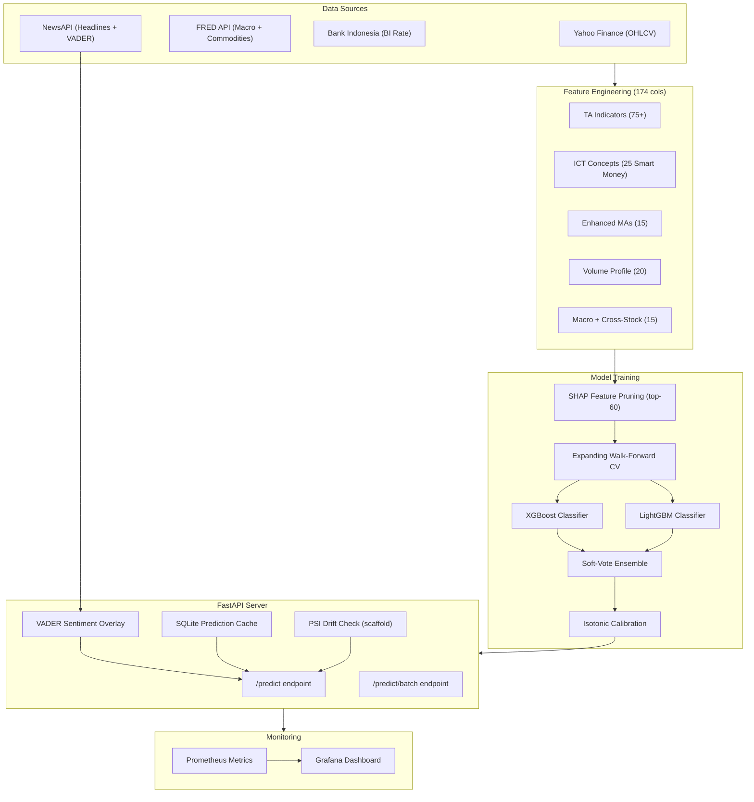
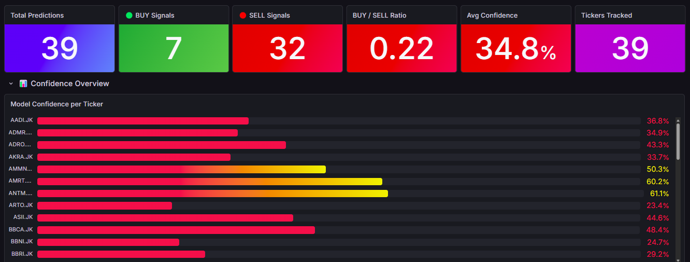
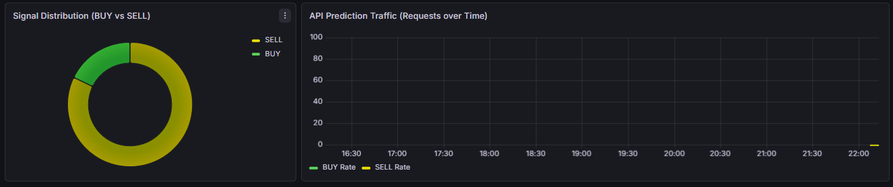

# 🇮🇩 Indonesian Stock Prediction — MLOps Pipeline


An end-to-end MLOps system that predicts **BUY/SELL signals** for 45 Indonesian blue-chip stocks (IDX) using machine learning, real-time monitoring, and automated retraining.

This project demonstrates production-grade MLOps practices including **SHAP feature selection**, **expanding walk-forward CV**, **ensemble blending (XGBoost + LightGBM)**, **parallel model training**, and **async metric seeding**.

---

## ✨ Key Features

| Feature | Description |
|---|---|
| 🤖 **SHAP Feature Selection** | TreeExplainer prunes to top-60 features per ticker for faster inference |
| 🔄 **Expanding Walk-Forward CV** | Each fold's training window grows — simulates real-world retraining |
| 🎯 **XGBoost + LightGBM Ensemble** | Soft-vote blend of XGBoost & LightGBM for better generalization |
| ⚡ **Parallel Training** | Joblib parallel across all 45 tickers (~15-20 min total) |
| 📰 **VADER Sentiment Overlay** | NewsAPI headlines → ±10% confidence adjustment in real-time |
| 🧠 **SHAP Feature Importance** | Per-ticker feature importance plots logged to MLflow |
| 💾 **SQLite Prediction Cache** | Sub-second responses after first daily hit |
| 📡 **Async Metric Seeding** | `aiohttp` parallel POST with exponential backoff to Prometheus |
| 📊 **Grafana Dashboard** | BUY/SELL counts, confidence distribution, API latency |
| 🔧 **Unified CLI** | `python cli.py predict\|backtest\|sentiment\|train\|serve\|status\|list` |

---

## 🏗️ Architecture



## 🗂️ Project Structure

```
├── src/
│   ├── features/              # Modular feature engineering package
│   │   ├── __init__.py         #   Re-exports all feature functions
│   │   ├── fetchers.py         #   fetch_fundamentals, fetch_usdidr, fetch_news_sentiment, etc.
│   │   ├── indicators.py       #   compute_ta_features, compute_custom_features
│   │   ├── enhanced_mas.py     #   compute_enhanced_mas (~15 features)
│   │   ├── ict.py              #   compute_ict_features (~25 ICT/Smart Money features)
│   │   ├── volume_profile.py   #   compute_volume_profile_features (~20 features)
│   │   ├── market.py           #   compute_market_context, compute_cross_stock_features
│   │   └── pipeline.py         #   engineer_features_for_ticker, build_feature_set
│   ├── ingest.py               # Fetch raw OHLCV data from yfinance
│   ├── train.py                # XGBoost + LGBM training with SHAP, expanding CV, parallel
│   ├── serve.py                # FastAPI prediction server with sentiment overlay + PSI drift
│   ├── backtest.py             # Walk-forward backtesting engine
│   ├── news_sentiment.py       # NewsAPI + VADER sentiment analysis
│   └── config.py               # Single source of truth: tickers, sectors, feature flags
├── cli.py                      # Unified CLI (predict, backtest, sentiment, train, serve, status, list)
├── data/
│   ├── raw/                    # Raw OHLCV CSVs (stocks.csv, ihsg.csv)
│   └── processed/              # Engineered feature CSV (features.csv)
├── mlruns/                     # MLflow experiment artifacts and model registry
├── scripts/
│   ├── build_model_index.py    # Build ticker → model folder mapping (reads MLflow tags)
│   ├── ci_features.py          # CI entry point for feature engineering
│   └── seed_metrics.py         # Async aiohttp parallel seeding to Prometheus
├── monitoring/
│   ├── prometheus.yml
│   ├── grafana-dashboard.json
│   └── grafana/                # Auto-provisioned Grafana datasources + dashboards
├── docker-compose.yml
├── Dockerfile
├── requirements.txt
├── requirements-docker.txt
├── start.bat                   # Full launcher menu (1-8: start/train/daily/weekly/tune/predict)
└── .env                        # API keys (never committed)
```

## 🚀 Quick Start

### Prerequisites
- [Docker Desktop](https://www.docker.com/products/docker-desktop/) installed and running
- Python 3.11 (only needed for local training)

### 1. Clone the repo
```bash
git clone https://github.com/rafifshaf-fun/indonesian-stock-mlops.git
cd indonesian-stock-mlops
```

### 2. Set up environment variables
```bash
# Copy and edit .env (never commit this file)
# Add keys for optional features:
#   FRED_API_KEY    → macro/commodity data (https://fred.stlouisfed.org)
#   NEWSAPI_KEY     → news sentiment scores (https://newsapi.org)
```

### 3. Start the stack

**Windows — double-click or run:**
```bat
start.bat          # Full menu: 1-Start, 2-Quick Retrain, 3-Full Retrain,
                   #           4-Tune, 5-Rebuild Docker, 6-Predict,
                   #           7-Daily Pipeline, 8-Weekly Retrain
```

**Linux / Mac / PowerShell:**
```bash
# Start Docker services
docker compose up -d

# Check if API is running
python cli.py status

# Quick prediction
curl -X POST http://127.0.0.1:8000/predict \
  -H "Content-Type: application/json" \
  -d '{"ticker": "BBCA.JK"}'
```

### 4. Daily Operation
```bash
# Activate venv
venv\Scripts\activate

# Fetch latest data → rebuild features → seed Grafana
python src/ingest.py
python scripts/ci_features.py
python scripts/seed_metrics.py
```

### 5. Weekly Retrain (Mondays)
```bash
python src/ingest.py
python scripts/ci_features.py
python src/train.py --parallel       # ~15-20 min, 45 models
python scripts/build_model_index.py
docker compose up -d --force-recreate api
python scripts/seed_metrics.py
```

---

## 🌐 Service URLs

| Service | URL | Notes |
|---|---|---|
| Prediction API | `http://127.0.0.1:8000` | Use 127.0.0.1 not localhost on Windows |
| API Docs | `http://127.0.0.1:8000/docs` | Interactive Swagger UI |
| Cache Status | `http://127.0.0.1:8000/cache` | Prediction cache coverage |
| MLflow UI | `http://localhost:5000` | Experiment tracking |
| Grafana | `http://localhost:3000` | admin/admin |
| Prometheus | `http://localhost:9090` | Raw metrics |

---

## 📡 API Usage

### Prediction (with sentiment overlay)
```bash
curl -X POST http://127.0.0.1:8000/predict \
  -H "Content-Type: application/json" \
  -d '{"ticker": "BBCA.JK"}'
```

**Response (v2.2+):**
```json
{
  "ticker": "BBCA.JK",
  "prediction": 0,
  "probability_up": 0.4789,
  "signal": "SELL",
  "sentiment_score": 0.1523,
  "probability_adjusted": 0.4941,
  "signal_adjusted": "SELL"
}
```

| Field | Description |
|---|---|
| `prediction` | 0 = SELL, 1 = BUY |
| `probability_up` | Model confidence (0-1) |
| `sentiment_score` | VADER news sentiment (-1 to +1, 0 if unavailable) |
| `probability_adjusted` | Model confidence ±10% based on sentiment |
| `signal_adjusted` | Signal after sentiment overlay |
| `drift_warning` | PSI drift alert (true if drift > threshold) |
| `drift_score` | Population Stability Index score |

### Batch Prediction
```bash
curl -X POST http://127.0.0.1:8000/predict/batch \
  -H "Content-Type: application/json" \
  -d '{"tickers": ["BBCA.JK", "BBRI.JK", "TLKM.JK"]}'
```

### List tickers
```bash
curl http://127.0.0.1:8000/tickers
```

---

## 🖥️ CLI Usage

```bash
# Prediction
python cli.py predict BBCA.JK                   # Via API
python cli.py predict BBCA.JK --local           # Local model (no API needed)
python cli.py predict --all --json              # All 45, JSON output

# Backtest (walk-forward simulation)
python cli.py backtest                           # Threshold 0.50
python cli.py backtest --threshold 0.65          # Higher confidence

# Sentiment
python cli.py sentiment BBCA.JK                 # Single ticker
python cli.py sentiment --all                    # All 45

# Training
python cli.py train                              # Train all models (sequential)
python cli.py train --parallel                   # All 45 in parallel (15-20 min)
python cli.py train --parallel --no-shap         # Parallel without SHAP pruning
python cli.py train --ticker BBCA.JK --tune      # Tune single ticker

# Status & Info
python cli.py status                             # Check API health
python cli.py list                               # List all tickers by sector
```

---

## 📊 Data Sources

| Source | Data | Update |
|---|---|---|
| Yahoo Finance | OHLCV, PE/PB, market cap, ROE, USD/IDR | Daily |
| FRED API | WTI oil, gold, coal, nickel, VIX, US 10Y | Daily |
| Bank Indonesia | BI 7-Day Reverse Repo Rate | Per meeting |
| NewsAPI | English + Indonesian news headlines | Per request |
| VADER | Lexicon-based sentiment on headlines | Per request |

---

## 🧠 Model Details

- **Algorithms** — XGBoost Classifier + LightGBM (soft-vote ensemble blend)
- **Target** — Binary: 1 (next day close > today close) / 0 (otherwise)
- **Feature Selection** — SHAP TreeExplainer (top-60 features per ticker, `--no-shap` to disable)
- **Validation** — Expanding walk-forward CV (each fold grows, `--no-expand-cv` for fixed windows)
- **Calibration** — Isotonic regression (`CalibratedClassifierCV`) for probability calibration
- **Parallel Training** — `--parallel` flag uses joblib across all 45 tickers (~15-20 min)
- **Features** — 174 raw → 60 after SHAP pruning
- **Sentiment overlay** — ±10% adjustment from VADER news sentiment via NewsAPI
- **Drift Detection** — PSI (Population Stability Index) scaffold in API response

### Training Options

| Flag | Default | Description |
|---|---|---|
| `--parallel` | false | Train all 45 tickers in parallel via joblib |
| `--no-shap` | false | Disable SHAP feature selection (use correlation pruning) |
| `--no-expand-cv` | false | Use fixed TimeSeriesSplit instead of expanding CV |
| `--no-blend` | false | Disable LGBM blend (XGBoost only) |
| `--tune` | false | Optuna hyperparameter tuning (top-10 tickers) |

## 🔧 Configuration (`src/config.py`)

| Flag | Default | Description |
|---|---|---|
| `ta_indicators` | true | 75 TA indicators from `ta` library |
| `enhanced_mas` | true | 15 enhanced moving average features |
| `ict_suite` | true | 25 ICT Smart Money Concepts features |
| `volume_profile` | true | 20 intraday volume profile features |
| `market_context` | true | 15 market/cross-stock features |
| `news_sentiment` | true | VADER sentiment from NewsAPI |
| `fred_macro` | true | FRED macro indicators |
| `bi_rate` | true | Bank Indonesia rate scraping |
| `google_trends` | true | Google Trends sentiment |

---

## 📸 Screenshots




---

## 📄 License

MIT License — feel free to use, modify, and distribute.
